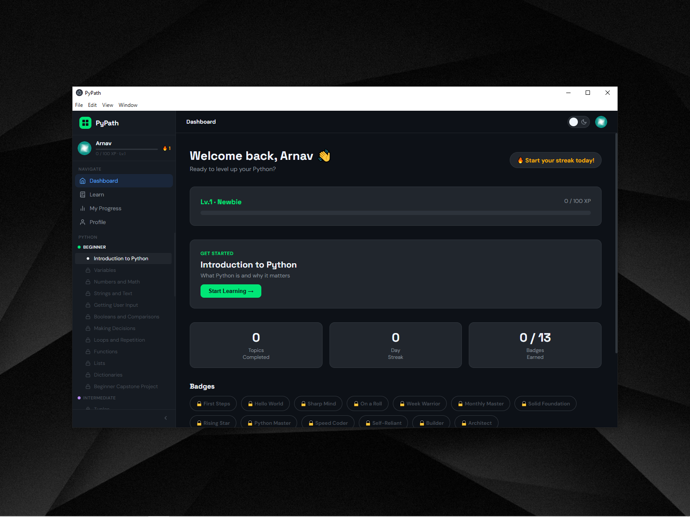
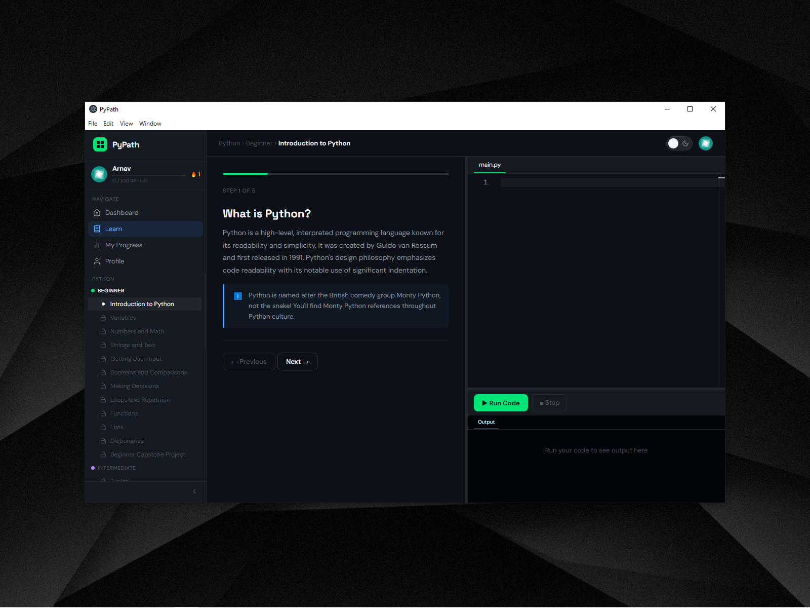
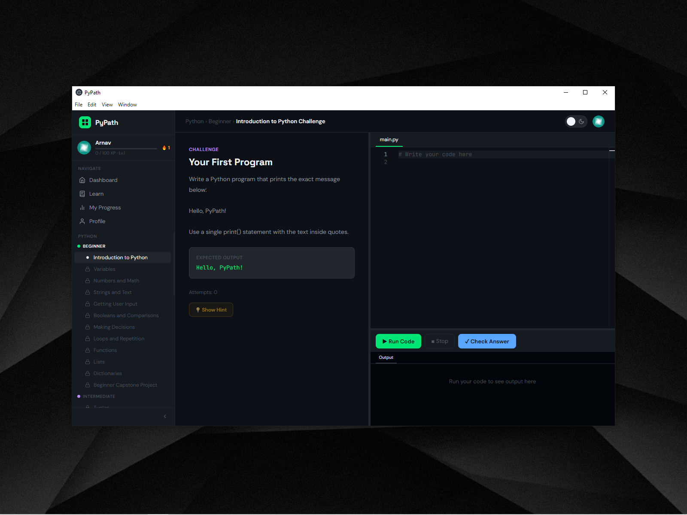

# PyPath 🐍

> **Learn Python. One path at a time.**

An offline, interactive Python learning desktop app for Windows — built with Electron. PyPath takes anyone from complete beginner to advanced Python developer through a structured curriculum of **36 topics**, each with real lessons, quizzes, and coding challenges that run actual Python code right inside the app.

---

## ✨ Features

- 📚 **36-Topic Curriculum** — Beginner → Intermediate → Advanced, all based on the official Python 3.12 documentation
- ⌨️ **Built-in Code Editor** — Monaco Editor (the same editor that powers VS Code) with Python syntax highlighting
- 🐍 **Real Python Execution** — Write and run actual Python code offline, with instant output
- 🧠 **Adaptive Learning** — Topics unlock based on prerequisites and quiz performance
- 🏆 **Badges & XP** — 13 badges, 10 levels, daily streaks, and XP rewards
- 👤 **Multiple Profiles** — Up to 6 learner profiles on one machine, each with independent progress
- 🌙 **Dark & Light Mode** — Full theme switching with a satisfying animated toggle
- 🔍 **Zoom Controls** — `Ctrl++` / `Ctrl+-` / `Ctrl+ScrollWheel` — just like your browser
- 📊 **Progress Tracking** — Per-topic completion, weak topic detection, and a full My Progress page
- 📴 **Fully Offline** — No internet required after setup. No account. No subscriptions.

---

## 📸 Screenshots

> *(Add screenshots here once uploaded to the repo)*

| Dashboard | Lesson Viewer | Code Challenge |
|---|---|---|
|  |  |  |

---

## 📚 Curriculum

### 🟢 Beginner (12 topics)
Introduction to Python · Variables · Numbers and Math · Strings and Text · Getting User Input · Booleans and Comparisons · Making Decisions · Loops and Repetition · Functions · Lists · Dictionaries · Beginner Capstone Project

### 🟣 Intermediate (12 topics)
Tuples · Sets · List and Dict Comprehensions · String Formatting in Depth · Reading and Writing Files · Error Handling (try/except) · Modules and Imports · The Random Module · Working with Dates and Time · The Math Module · Useful Built-in Functions · The OS Module

### 🟡 Advanced (12 topics)
Classes and Objects · Inheritance and Polymorphism · Magic Methods · Decorators · Generators and Iterators · Context Managers · Lambda Functions · Variable Arguments (*args/**kwargs) · Regular Expressions · Working with JSON · The Collections Module · The Itertools Module

---

## 🚀 Getting Started

### Prerequisites

- **Windows 10/11** (64-bit)
- **Node.js** v18 or higher — [nodejs.org](https://nodejs.org)
- **Python 3.8+** — [python.org](https://python.org) *(must be on your system PATH)*
- **Git** — [git-scm.com](https://git-scm.com)

### Installation

```bash
# 1. Clone the repository
git clone https://github.com/YOUR_USERNAME/PyPath.git
cd PyPath

# 2. Install dependencies
npm install

# 3. Rebuild native modules for Electron
npm run rebuild

# 4. Start the app
npm start
```

> **Note:** The `npm install` step automatically rebuilds `better-sqlite3` for Electron via the `postinstall` script. If you ever hit a `NODE_MODULE_VERSION` mismatch error, run `npm run rebuild` manually.

### Launching the App

After installation, you can launch PyPath in two ways:

**Option A — Terminal (during development)**
```bash
npm start
```

**Option B — Shortcut (recommended for daily use)**

A `PyPath.vbs` file is included in the repo root. You can:
- Double-click it directly from the project folder, OR
- Make a shortcut of it and place anywhere you want (like Desktop, taskbar, Start Menu, etc.)

It will always find and launch PyPath correctly regardless of where you place it — no terminal needed.

> **Note:** The shortcut (if you create) uses `PyPath.vbs` under the hood, which launches the app with no visible terminal window — PyPath just appears cleanly like any installed app.

> ⚠️ **Shortcut notice:** You could Create your own shortcut in 3 steps:
> 1. Right-click `Start PyPath.vbs` in the cloned folder → **Create shortcut**
> 2. Move it anywhere you want — Desktop, Start Menu, etc.

### Scripts

| Command | Description |
|---|---|
| `npm start` | Launch PyPath from terminal |
| `npm run rebuild` | Rebuild native modules for Electron |

---

## 🏗️ Tech Stack

| Layer | Technology |
|---|---|
| App Shell | [Electron](https://electronjs.org) |
| Code Editor | [Monaco Editor](https://microsoft.github.io/monaco-editor/) |
| Code Execution | Python subprocess via Node.js `child_process` |
| Database | [better-sqlite3](https://github.com/WiseLibs/better-sqlite3) (SQLite) |
| Frontend | Vanilla HTML + CSS + JavaScript |
| Fonts | Space Grotesk · JetBrains Mono · DM Sans |
| Packaging | [electron-builder](https://www.electron.build/) |

---

## 📁 Project Structure

```
pypath/
├── main/                    # Electron main process (Node.js)
│   ├── main.js              # App entry point
│   ├── database.js          # SQLite operations
│   ├── pythonRunner.js      # Python subprocess manager
│   └── ipc/                 # IPC handlers
├── renderer/                # Frontend (HTML/CSS/JS)
│   ├── index.html           # App shell
│   ├── css/                 # Stylesheets + design tokens
│   └── js/                  # App logic, pages, components
├── content/python/          # Curriculum content (JSON)
│   ├── beginner/
│   ├── intermediate/
│   └── advanced/
└──  assets/                  # Icons, avatars
```

---

## 🤝 Contributing

Contributions are welcome! PyPath is designed to be extended:

- **Add new topics** — Follow the JSON schema in `AGENTS.md` Section 7 to add lessons, quizzes, and challenges
- **Add new languages** — The content system is data-driven; adding JavaScript, C++, etc. is just new content files
- **Bug fixes & improvements** — Open an issue or submit a PR

### Adding a New Topic

1. Add the topic entry to `content/python/index.json` with an id, title, description, and prerequisites
2. Create `content/python/{tier}/{slug}.json` (lesson), `{slug}-quiz.json`, and `{slug}-challenge.json`
3. Follow the schemas in `AGENTS.md` Section 7 exactly
4. The app picks it up automatically — no code changes needed

---

## 🗺️ Roadmap

- [ ] More Python topics (pathlib, csv, logging, asyncio, threading)
- [ ] JavaScript curriculum
- [ ] Packaged `.exe` installer
- [ ] Project-based learning mode
- [ ] Hint system improvements
- [ ] Mobile/web version

---

## 📄 License

MIT License — see [LICENSE](LICENSE) for details.

---

## 🙏 Acknowledgements

- Python curriculum based on the official [Python 3.12 Documentation](https://docs.python.org/3.12/)
- Code editor powered by [Monaco Editor](https://microsoft.github.io/monaco-editor/)
- Built with [Electron](https://electronjs.org)

---

<div align="center">
  <strong>Built by Arnav Jain</strong><br>
  <em>AI-assisted development using Claude</em>
</div>
